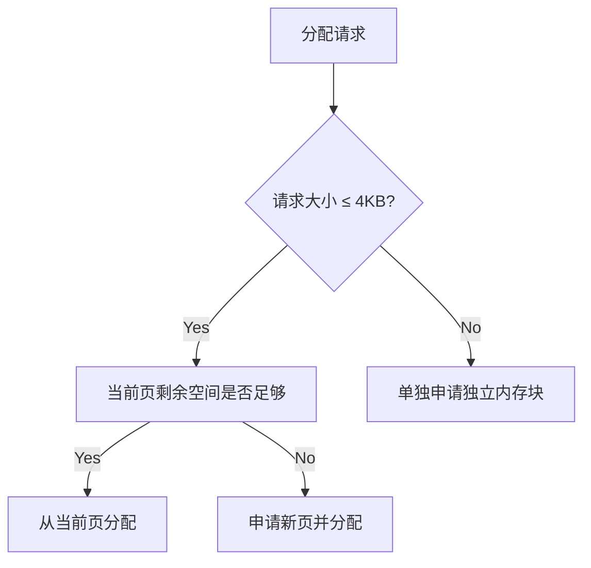

# RecGo 内存优化实践：化零为整的工程实现

## 背景与挑战

在推荐系统实时推理场景中，RecGo采用本地内存存储百万级物料特征时面临典型挑战：每次全量更新物料池会产生N×M量级（N:物料数，M:特征维度）的细粒度内存对象。这些对象呈现以下特征：

- **异构数据类型**：包含标量(int64/float32)、字符串及嵌套数组
- **生命周期同步**：全量更新时存在瞬时新旧双缓存
- **高频只读访问**：推荐请求需在ms级完成千次特征访问

但在实际落地时，我们发现每次加载新物料池会产生数百万乃至上亿个微对象，从而引发两个核心问题：

- GC性能瓶颈
  频繁GC导致延迟波动较大，存在性能尖峰，服务可用性降低

- 内存碎片化
  多版本物料池共存时，内存碎片问题更加严重

## 方案选型分析

### 方案一：C/C++混合编程

通过cgo调用C/C++实现内存管理模块时，发现存在三个关键限制：

1. **调用栈开销**：每次跨语言调用需额外几百纳秒上下文切换，在调用量非常大的情况下存在性能瓶颈
2. **序列化损耗**：特征结构体在Go/C/C++间的Marshal/Unmarshal产生性能消耗

### 方案二：连续内存管理（Arena模式）

基于Go语言特性实现内存池管理，核心设计原则：

- CAS替换：物料池全量替换时原子切换指针

- 空间预分配：按4KB页管理内存单元

- 类型特化：支持6种基础特征类型（int64/float32/string/[]int64/[]float32/[]string）
  


#### 工程实现详解

##### 内存管理架构

```go
const pageSize = 4096 // 内存页基准单位

type Arena struct {
    sync.RWMutex      // 读写锁保障并发安全
    pages    [][]byte // 内存页集合
    cur      uintptr  // 当前页偏移量
}
```

##### 分配策略



##### 数据类型处理

这里以最复杂的string和[]string进行介绍。

###### 字符串存储优化

```go
// Go运行时字符串结构
type stringHeader struct {
    Data uintptr
    Len  int
}
```

Arena中的存储格式

| Data指针  | 长度      | 实际字节数据    |
| ------- | ------- | --------- |
| 8 bytes | 8 bytes | Len bytes |

###### 字符串切片存储方案

```go
// 原生切片结构
type sliceHeader struct {
    Data uintptr
    Len  int
    Cap  int
}
```


Arena中的存储格式

| 切片Data指针 | 长度      | 容量      | 字符串头数组     | 实际字符串切片所有数据 |
| -------- | ------- | ------- | ---------- | ----------- |
| 8 bytes  | 8 bytes | 8 bytes | N*16 bytes | Variable    |


###### 内存对齐处理

要注意的是，go中的对象的地址是要进行对齐的，即每个对象的地址都要进行8字节对齐