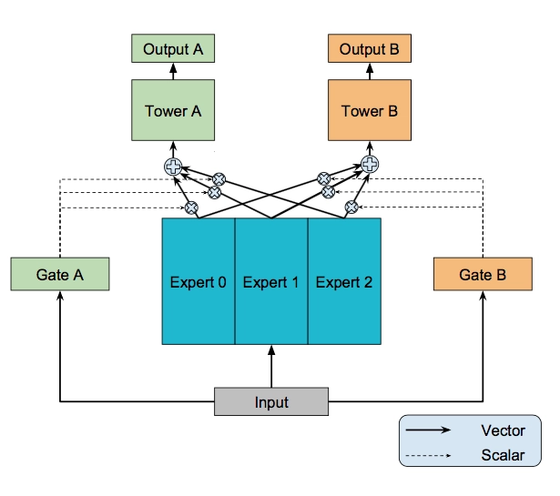
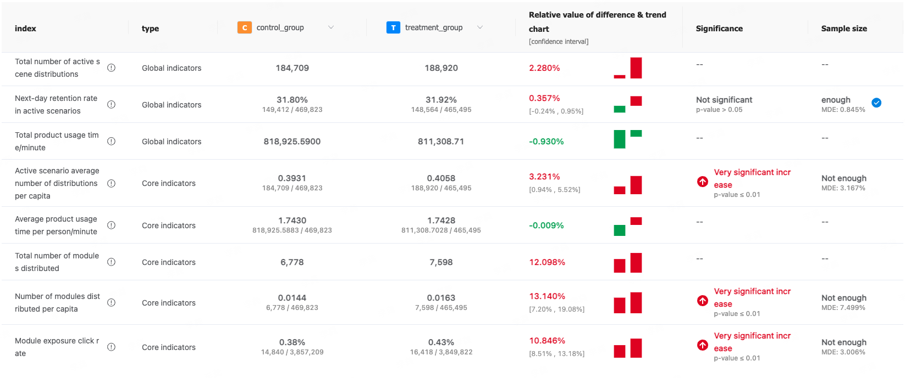

# Application of the MMOE Model in AppS

In the AppS business, recommendation systems need not only to improve user Click-Through Rate (CTR) but also to enhance Conversion Rate (CVR) to achieve comprehensive user engagement and business growth. The Multi-gate Mixture-of-Experts (MMOE) model offers an efficient solution by simultaneously optimizing multiple objectives to meet these business needs.

## Introduction

In the field of recommendation systems and advertising, models often need to optimize multiple objectives simultaneously, such as Click-Through Rate (CTR) and Conversion Rate (CVR). The Multi-gate Mixture-of-Experts (MMOE) model provides an effective solution by achieving better goal synergy optimization within a multi-task learning framework.

### 1. What is MMOE?

MMOE (Multi-gate Mixture-of-Experts) is a deep learning architecture for multi-task learning, designed to simultaneously optimize multiple related but distinct objectives. It introduces multiple "expert" networks and "gating" mechanisms to dynamically select and combine different expert outputs to meet the needs of different tasks.

#### Core Components

- **Expert Networks**: Multiple sub-networks, each responsible for learning different representations of input features to meet the needs of different tasks.
- **Gating Networks**: For each task, MMOE introduces an independent gating network responsible for selecting the appropriate combination of experts for the input sample. The gating network dynamically allocates weights to each expert based on input features.

#### Working Principle

MMOE combines expert networks through the gating mechanism, enabling the model to flexibly select the most suitable feature combinations for each task while sharing basic features. This mechanism allows for the sharing of information between tasks while mitigating negative transfer effects.

### 2. Why Use MMOE?

In business scenarios, especially in advertising and recommendation systems, it is often necessary to optimize multiple key metrics simultaneously. For example, improving Click-Through Rate (CTR) and Conversion Rate (CVR) are common business objectives. Traditional single-task models often struggle to balance these goals, while MMOE offers an ideal solution for multi-objective optimization.

#### Business Goals: Considering CTR and CVR

- **Improving CTR (Click-Through Rate)**: CTR is a metric that measures the ability of advertisements or recommendations to attract user clicks. Increasing CTR can directly enhance user interaction and engagement.

- **Improving CVR (Conversion Rate)**: CVR is a metric that measures the ability of users to complete target behaviors (such as purchases, registrations, etc.). Enhancing CVR can directly impact the business's final revenue.

#### Why Choose MMOE?

- **Task Synergy Optimization**: MMOE allows for the simultaneous optimization of CTR and CVR objectives by sharing feature representations of expert networks and using independent gating mechanisms.
- **Reducing Negative Transfer**: Through the combination of experts and gating, MMOE effectively reduces negative transfer effects between tasks, ensuring that optimizing one objective does not significantly harm the other.
- **Dynamic Adaptability**: The dynamic gating mechanism of MMOE enables the model to adjust expert combinations in real-time based on input features, adapting to different user behavior patterns and preferences.

MMOE demonstrates its strong adaptability and optimization performance in multi-task learning. For scenarios that require simultaneous consideration of multiple business goals, such as optimizing ad CTR and CVR, MMOE provides an efficient and flexible solution. By designing expert and gating structures wisely, MMOE can achieve more refined recommendation and advertising strategies in complex business environments.

## Application

### Model Architecture and Strategy

#### 1. Retaining FM Cross Strategy

In the MMOE architecture, we continue to retain the original Factorization Machine (FM) cross strategy. This strategy excels in modeling low-order feature interactions, effectively capturing the basic relationship between users and content. We integrate FM's output into the final output of MMOE to ensure full utilization of basic feature interaction information.

#### 2. Expert Network Design

The MMOE model employs two expert networks, each focusing on learning different feature combinations. Through diversified expert network design, the model can capture user behavior patterns from different perspectives and enhance adaptability to complex data.

#### 3. Gating Mechanism

We designed two independent gating networks responsible for optimizing CTR and CVR, respectively:

- **CTR Gating**: Controls the expert combination related to click-through rate features, ensuring that recommended content can attract user clicks.
- **CVR Gating**: Optimizes the feature combination related to download conversion, increasing the probability of users downloading applications.

#### 4. Training Strategy

During model training, we use click and download behaviors as task labels and design a fixed-weight loss function:

- **Loss Weight Allocation**:
  - The loss weight for PCTR is set to 0.95, emphasizing the optimization of click behavior.
  - The loss weight for PCTCVR is set to 0.05, ensuring that download behavior receives appropriate attention.

This weight allocation ensures that CTR is the primary optimization direction while also considering the CVR objective.

#### 5. Online Inference and Ranking

During online inference, we apply the same weights to PCTR and PCVR and rank them based on the weighted scores. Through this strategy, we can balance the priorities of clicks and downloads in recommendation ranking, optimizing user experience and business metrics.

### AB Testing Results

By applying the MMOE model in the "Guess You Like" module, our AB testing results showed a **13.1%** increase in average distribution per user. This significant improvement validates the effectiveness of the MMOE model in simultaneously optimizing CTR and CVR, bringing higher user engagement and conversion rates to the AppS business.

### Conclusion

The MMOE model achieves comprehensive optimization of CTR and CVR in the AppS business through its flexible expert and gating mechanisms. Combined with the FM cross strategy, MMOE not only enhances the predictive ability of recommendation systems but also improves multi-objective synergy optimization of user behavior, providing strong support for business development.

## Further Reading

- [Modeling Task Relationships in Multi-task Learning with
  Multi-gate Mixture-of-Experts](https://dl.acm.org/doi/pdf/10.1145/3219819.3220007)

- [The Annotated Multi-Task Ranker: An MMoE Code Example](https://www.yuan-meng.com/posts/mtml/)
