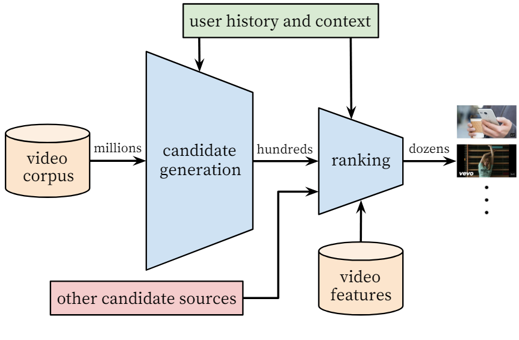

# Tracing Data Origins and Causality: The "Element Tracing Method" in Recommendation Systems

When studying biology in high school, teachers introduced the **isotope labeling method** to investigate how oxygen participates in complex biological processes.

Isotopes used to track substance movement and transformations are called **tracer elements**. By tracing compounds labeled with these elements, scientists can unravel intricate biochemical reactions. This methodology ensures that labeled compounds retain **unchanged chemical properties** while enabling **high-sensitivity measurements, simplified positioning, and accurate quantification**.

---

## **Background**

Observing the system architecture, the recommendation algorithm sits at the terminal end of the workflow chain:  
**Client (App/Browser) → Server → Data Processing Center → Recommendation Engine**. Despite its position, the algorithm critically impacts user experience and content distribution efficiency.

Internally, personalized recommendation systems are highly complex. A typical industrial architecture includes four modules: **Retrieval, Ranking, Rule-Based Intervention, and Layout**, along with **feature engineering** and **positive/negative sampling** during model training.

Minor parameter adjustments in such systems can trigger **butterfly effects**, causing significant metric fluctuations. Root cause analysis in fast-evolving production environments often takes engineers days to complete.

---

## **Solution Design**

Inspired by biochemical isotope tracing, we designed a dual-path tracing framework for both **business workflows** and **data flows**:

### **Business Workflow (Black Solid Lines)**

1. Client requests are routed through business servers to the recommendation engine.
2. The engine returns content with **trace metadata**:
   - Experiment group ID for A/B testing
   - Content attribution ID (e.g., trending-content strategy ID)
3. Servers propagate trace metadata to clients.
4. Clients embed trace information into each content item's metadata.

### **Data Flow (Blue Dashed Lines)**

Three synchronized data sources ensure accuracy:

1. **Server logs** (requests/responses with trace metadata) stream to the data center (Paths 1-2).
2. **Rec Engine logs** (Path 3) provide strategy execution details.
3. **Client behavior logs** (exposures/clicks/purchases) report user interactions (Path 4).
4. Real-time dashboards monitor metrics like experiment group performance.

---

## **Key Applications**

The "element tracing method" enables four critical capabilities:

**1. Experiment Group Validation**  
Verify A/B test group distribution uniformity via experiment IDs in trace metadata.

**2. Data Integrity Assurance**  
Cross-validate engine logs, server logs, and client logs (e.g., comparing server-delivered vs client-exposed content counts) to pinpoint pipeline issues.

**3. Attribution Analysis**  
Track content reach rates, effective exposures, and user conversions using end-to-end trace markers.

**4. Dynamic Strategy Optimization**  
Monitor real-time performance of multi-strategy systems, enabling rapid adjustments to underperforming strategies.

By embedding lightweight yet information-dense **trace markers**, this method achieves:

- **Full data lineage tracing**
- **Minimal system intrusion** (negligible bandwidth overhead, no workflow changes)
- **Actionable operational insights**

