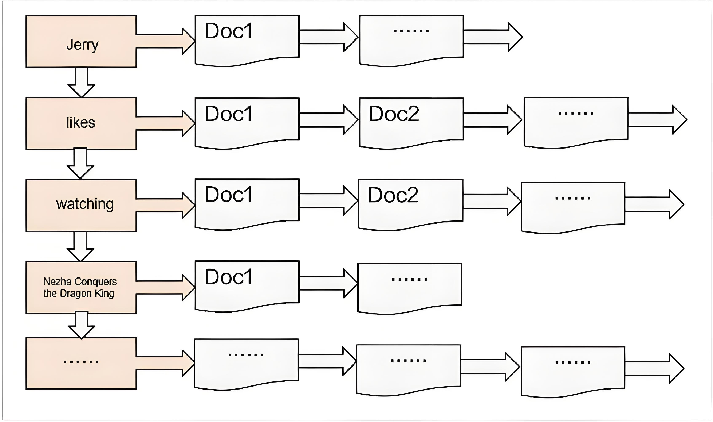
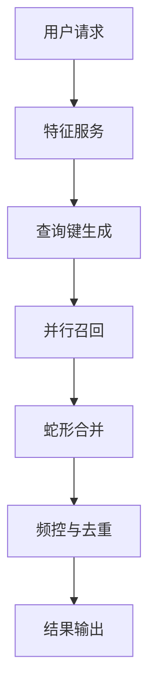

# 倒排召回系统设计

## 倒排索引

### 基本定义
倒排索引（Inverted Index）是一种将内容映射到文档位置的索引结构，本质是"词项→文档"的逆向映射关系。与正排索引（文档→内容）形成互补。

<center>

</center>

### 核心组成
- **词典（Term Dictionary）**：所有唯一词项的排序集合
- **倒排列表（Posting List）**：每个词项对应的文档ID序列
- **位置信息（Position）**：可选存储词项在文档中的具体位置


## 索引结构类型

### 1. 基本倒排索引
```text
[词项A] → [文档1, 文档3, 文档5]
[词项B] → [文档2, 文档4]
```

### 带权倒排索引
```json
{
  "机器学习": [
    {"doc_id": 101, "weight": 0.95},
    {"doc_id": 205, "weight": 0.87}
  ]
}
```

### 多维倒排索引
支持复合键的索引形式：
```text
"价格区间_品类" → [商品ID列表]
```

## 召回机制概述

### 常见召回类型及触发逻辑

#### I2I(Item-To-Item, e.g: ICF)召回


- **核心逻辑**：
通过用户历史交互物品作为初始查询种子，触发多阶段召回过程。首先获取用户近期有过交互行为的物品集合作为初始查询键，随后基于预构建的物品相似度矩阵进行近邻扩展，获取与种子物品最相关的候选物品集合。在工程实现层面，典型的i2i召回系统会采用并行查询架构，将用户的历史物品集合分片后并发查询相似矩阵，最后通过聚合算子（轮转式去重合并）合并各分片的召回结果，形成最终的候选物品集合。

- 深度阅读可以参考下面的网页：
  - [Collaborative Filtering in Machine Learning](https://www.geeksforgeeks.org/collaborative-filtering-ml/)
  - [How collaborative filtering works](https://www.ibm.com/think/topics/collaborative-filtering)
  - [Collaborative Filtering Recommendation System](https://mlarchive.com/machine-learning/collaborative-filtering-recommendation-system/)
  - [一文说尽协同过滤算法中的相似度计算](https://zhuanlan.zhihu.com/p/653379602)


- **存储示例**：
```json
{
    "key": "item_sim_123",  // 商品123的相似列表
    "value": [{"456":0.85}, {"789":0.76},...] // 按相似度降序存储
}

```

#### 用户画像召回

- **核心逻辑**

用户画像的核心在于标签化，即通过标签体系对用户特征进行结构化表征，从而更精确地刻画用户属性。兴趣标签仅是其中一种维度，完整的用户画像通常涵盖自然属性（如年龄、性别）、社会属性（如职业、地域）、业务属性（如消费频次、客单价）、设备属性（如终端型号、操作系统）等多个方面。在构建用户画像标签体系后，用户画像标签作为查询键检索倒排索引，实现从特征到候选集的精准召回。


### 总结
上述召回过程的核心机制是通过用户特征生成查询键，进而检索倒排索引。基于这一原理，我们设计了以下方案。


## 系统架构设计

### 核心处理流水线


### 关键组件说明

#### 查询键生成工具:[Minia](https://github.com/uopensail/minia) 

Minia 是一个高效的 C++ 特征处理库，专注于通过表达式驱动的方式实现一致且灵活的特征转换。用户只需在配置文件中定义表达式规则，即可自动应用于召回、模型训练和推理等，确保数据处理逻辑严格一致，避免特征偏差。

- 核心优势：表达式处理
自定义表达式语法：基于 ANTLR 实现，支持复杂数学、统计、字符串及日期运算（如 sqrt(x), bucket(age, [0,18,60])）。

- 智能优化：自动进行常量折叠、公共子表达式消除等优化，减少冗余计算，提升执行效率。

- 动态类型转换：支持 cast() 等操作，灵活处理多类型数据（数值、向量、字符串等）。

- 简洁配置，统一流程

TOML 配置：通过声明式规则定义特征变换，如：

```toml
[transform]
expressions = ['user_gender_cat1 = concat(gender, cat1_prefer)']
features = ["user_gender_cat1"]
```


#### 轮转式去重合并(Round Robin Merge)

依次从各召回列表中选取元素，确保结果兼具多样性和有序性。
- 去重优先：自动跳过已存在元素，避免冗余。

- 轮转均衡：按轮次平等分配各召回源的曝光机会，兼顾多样性。

- 顺序保留：在全局去重基础上，尽量维持各列表内部排序。

假设有3个召回通道：
```text
召回1: [A, B, C]
召回2: [B, D]
召回3: [A, E]


合并过程：
1. 第一轮：
   - 召回1取A
   - 召回2取B 
   - 召回3取A(跳过，已存在)
   → 结果：[A, B]

2. 第二轮：
   - 召回1取B(跳过)
   - 召回2取D
   - 召回3取E
   → 结果：[A, B, D, E]

3. 第三轮：
   - 召回1取C
   - 召回2已耗尽
   - 召回3已耗尽
   → 最终结果：[A, B, D, E, C]

```


