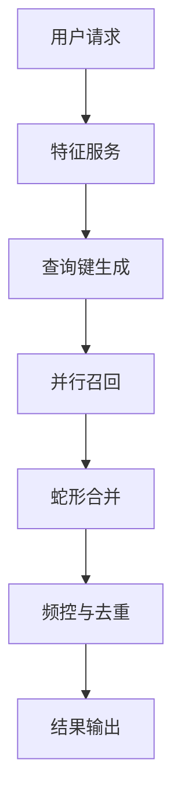

# 倒排召回系统设计

## 倒排索引

### 基本定义
倒排索引（Inverted Index）是一种将内容映射到文档位置的索引结构，本质是"词项→文档"的逆向映射关系。与正排索引（文档→内容）形成互补。

<center>

</center>

### 核心组成
- **词典（Term Dictionary）**：所有唯一词项的排序集合
- **倒排列表（Posting List）**：每个词项对应的文档ID序列
- **位置信息（Position）**：可选存储词项在文档中的具体位置


## 索引结构类型

### 1. 基本倒排索引
```text
[词项A] → [文档1, 文档3, 文档5]
[词项B] → [文档2, 文档4]
```

### 带权倒排索引
```json
{
  "机器学习": [
    {"doc_id": 101, "weight": 0.95},
    {"doc_id": 205, "weight": 0.87}
  ]
}
```

### 多维倒排索引
支持复合键的索引形式：
```text
"价格区间_品类" → [商品ID列表]
```

## 召回机制概述

### 常见召回类型及触发逻辑

#### I2I(Item-To-Item, e.g: ICF)召回
- **核心逻辑**：
  - 以用户历史交互物品为查询种子
  - 通过预计算的物品相似矩阵扩展候选集
  - 典型实现包含并行查询与结果聚合

- **存储示例**：
```json
{
    "key": "item_sim_123",  // 商品123的相似列表
    "value": [{"456":0.85}, {"789":0.76},...] // 按相似度降序存储
}

```

#### 多模态兴趣召回
- **执行流程**：
  1. 特征分层解析：
     - 时序特征：会话级/天级/月级行为
     - 维度特征：品类/价格带/内容标签
  2. 动态键值构造（如"品类_时段_频次"）

#### 实时动态召回
- **更新策略**：
  - 时间衰减热度计算（滑动窗口统计）
  - 空间维度分层（地理围栏/城市分级）
  - 设备特征融合（品牌/操作系统/分辨率）

### 总结
上述的召回，其实本质上就是基于用户特征生成查询键，然后再到倒排索引中去查询。因此才有了我们下面的设计。

## 系统架构设计

### 核心处理流水线


### 关键组件说明

#### 查询键生成:[minia](https://github.com/uopensail/minia) 
- **功能特性**：
  - 支持DSL配置化规则
  - 实时处理


#### 蛇形合并

假设有3个召回通道：
```text
召回1: [A, B, C]
召回2: [B, D]
召回3: [A, E]


合并过程：
1. 第一轮：
   - 召回1取A
   - 召回2取B 
   - 召回3取A(跳过，已存在)
   → 结果：[A, B]

2. 第二轮：
   - 召回1取B(跳过)
   - 召回2取D
   - 召回3取E
   → 结果：[A, B, D, E]

3. 第三轮：
   - 召回1取C
   - 召回2已耗尽
   - 召回3已耗尽
   → 最终结果：[A, B, D, E, C]

```


