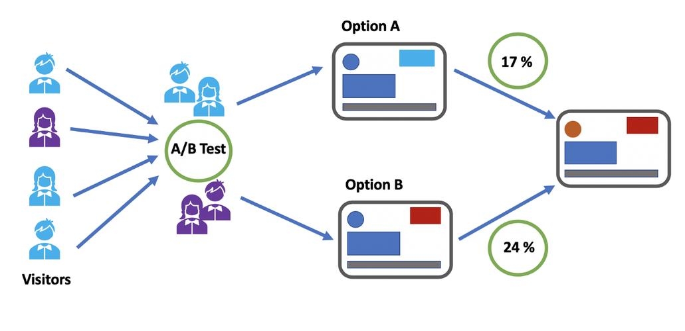
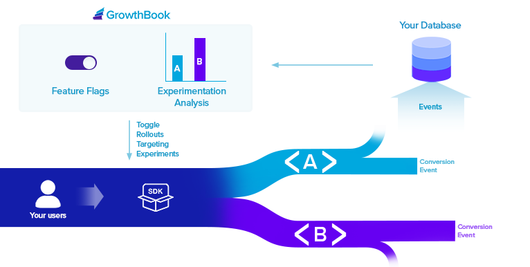

# 深入解析AB测试：从分流原理到GrowthBook的最佳实践

## 1. AB测试简介

AB测试（A/B Testing）是一种通过实验来验证改动是否有效的方法。它的核心在于将用户随机分配到不同的版本（如版本A和版本B），然后通过数据分析判断哪一个版本更符合预期目标。

<center>

</center>

AB测试的主要应用包括：

- 优化界面设计（例如按钮颜色、布局等）。
- 验证新功能或新算法的效果（例如推荐系统/算法改进）。
- 提升业务指标（例如转化率、留存率等）。

AB测试的流程：

1. **明确目标**：确定希望优化的核心指标。
2. **设计实验**：准备改动内容和实验组（A组、B组等）。
3. **分流用户**：以随机化方式将用户分配到不同版本。
4. **数据收集**：监测用户行为，记录相关指标。
5. **结果分析**：通过统计学方法判断实验组的表现是否显著优于对照组。

AB测试的本质是以数据驱动决策，帮助团队避免依赖主观假设，确保改动的科学性。

---

## 2. 用户分流的技术原理

用户分流是AB测试的关键环节，其目标是将用户随机分配到不同实验组，同时保证分配的公平性和一致性。分流的技术实现包括以下几种方法：

### 2.1 哈希函数分流

使用用户的唯一标识（如用户ID、Cookie或设备ID），通过哈希函数生成一个随机值，用于确定用户的分组。

常见的哈希函数：

- **MD5**：计算速度快，但加密安全性较低。
- **SHA-256**：更安全，但计算成本较高，适用于敏感数据场景。
- **MurmurHash**：高效且分布均匀，**非常适合分流场景**。

分组逻辑示例：

```
group = hash(user_id) % group_count
```

通过取哈希值的余数将用户分配到不同组。

### 2.2 伪随机数分流

基于伪随机数生成器（如Python的`random`模块），生成一个范围在[0,1]之间的随机数，根据预设比例进行分组。例如，60%的用户进入实验组A，40%的用户进入实验组B。

### 2.3 基于规则的分流

按用户属性（如地理位置、设备类型、浏览器版本等）进行分流。例如：

- 移动端用户进入A组。
- 桌面端用户进入B组。

### 2.4 动态分流

支持在实验进行中调整分流比例，适用于探索性实验或逐步放量实验。

#### 核心原则：

1. **随机性**：确保分组的公平性。
2. **一致性**：用户在实验期间的分组保持不变（持久性）。

---

# 3. 实验层级的设计

实验层级是指AB测试中对不同测试范围的划分，帮助团队更好地组织和管理实验。根据实验的目标和范围，层级可以分为以下几种：

- **界面层（UI层）**：测试界面设计的改动，例如按钮样式、页面布局等。
- **功能层**：验证某一功能模块（如支付功能、推荐功能）的影响。
- **算法层**：测试后端算法（如推荐排序、搜索优化）的改进效果。
- **业务逻辑层**：测试更深层次的系统逻辑变化，例如价格模型或库存策略。

通过合理的层级划分，可以提高实验的可控性，避免不同实验之间的干扰。


<center>




</center>

---

## 4. 正交层的概念及意义

**正交层**指的是在AB测试中相互独立、互不干扰的实验设计层。正交层的核心思想是通过独立分流和隔离数据，让多个实验可以同时运行。

### 正交层的技术实现：

1. **分流逻辑独立**：每个正交层拥有各自的分流规则，用户在不同层的分组互不干扰。
2. **数据隔离**：每个正交层的实验数据独立存储和分析，避免混淆。
3. **层优先级**：通过明确优先级解决多个正交层在边界条件下的冲突问题。

### 正交层的优势：

- **多实验并行**：支持多个实验同时运行，提高效率。
- **减少干扰**：保证一个实验的改动不会影响其他实验的结果。
- **准确性**：清晰评估每个实验变量的独立影响。

---

## 5. 如何计算置信度？

<center>


</center>

置信度是AB测试中评估实验结果显著性的关键指标，用于衡量结果的可靠性。

### 核心计算方法：

1. **假设检验**：
   
   - 原假设（H0）：实验组与对照组的表现无显著差异。
   - 计算统计量（如t值或z值），并通过显著性水平（如0.05）判断是否拒绝原假设。

2. **p值计算**：
   
   - p值表示实验结果或更极端结果在原假设下发生的概率。
   - 若p值小于显著性水平（如0.05），则认为实验结果具有统计显著性。

3. **置信区间**：
   
   - 通过计算实验组与对照组效果差异的置信区间，可以直观理解结果的可信范围。例如，若效果差异的置信区间为[2%, 5%]，则说明实验结果的提升范围在2%-5%之间。

---

## 6. [GrowthBook简介](https://www.growthbook.io/)

GrowthBook是[一款开源的AB测试](https://github.com/growthbook/growthbook.git)和功能管理平台，专为快速构建和运行实验而设计。它以轻量级、灵活性和易集成性著称，适合各种规模和复杂度的团队。

<center>

</center>

### 核心特点：

1. **去中心化分流**：
   - 实验逻辑下载到客户端或服务端本地完成，无需依赖分流服务。参加该网页：[Growthbook Using a CDN](https://docs.growthbook.io/self-host/cdn)
2. **动态实验配置**：
   - 支持实时更新实验规则和分流比例。
3. **多语言支持**：
   - 兼容多种语言（如Python、JavaScript、go）和框架，方便集成到现有系统。
4. **数据无缝对接**：
   - 可与主流数据分析工具（如Google Analytics）集成。
5. **开源社区**：
   - 拥有活跃的开发者社区，持续迭代和优化。

---

## 7. GrowthBook的分流机制

GrowthBook采用去中心化的分流机制，其核心流程：

1. **配置管理**：
   - 实验规则存储在服务器，客户端定期拉取更新。
2. **本地分流**：
   - 分流逻辑嵌入到客户端代码，用户分流完全在本地完成。
3. **持久化分组**：
   - 通过本地存储或后端记录，确保用户分组的一致性。

这种设计减少了对分流服务的依赖，提升了性能和稳定性。

---

## 8. 为什么选择GrowthBook？

GrowthBook的优势包括：

1. **技术先进**：去中心化分流机制简化了架构，提高了效率。
2. **灵活性高**：支持动态配置和多种语言集成。
3. **开源特性**：降低了使用成本，同时便于扩展。
4. **社区支持**：活跃的开发者社区提供持续更新和强大支持。

我们专注于推荐系统和推荐算法的优化，这是我们的核心竞争力。对于AB测试等非核心功能，我们选择使用行业领先的工具（如GrowthBook），这样既能专注于擅长的领域，又能借助专业工具实现最佳实践。


## 深入阅读

- [如何提供一个可信的AB测试解决方案 - 美团技术团队](https://tech.meituan.com/2023/08/24/ab-test-practice-in-meituan.html)

- [A/B testing - Wikipedia](https://en.wikipedia.org/wiki/A/B_testing)

- [GrowthBook Docs](https://docs.growthbook.io/)
