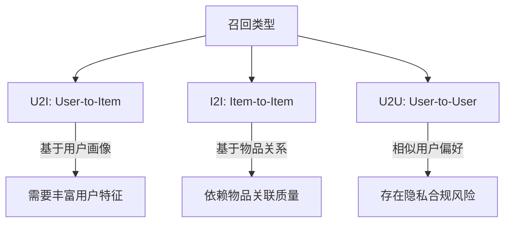

# 如何配置I2I召回

## 第一步：I2I召回技术详解

### 1. 核心定义与背景

I2I（Item-to-Item）召回是推荐系统的核心组件之一，最早由亚马逊在2003年提出并成功应用于电商推荐。其核心思想是通过建立**物品关联图谱**，利用用户历史行为中的物品线索进行关联推荐。与传统协同过滤（User-to-Item）不同，I2I聚焦于物品间关系的挖掘，尤其在用户行为稀疏的场景下表现出更强的鲁棒性。

### 2. 核心价值与应用场景

| 应用场景  | 典型示例             | 优势特性           |
| ----- | ---------------- | -------------- |
| 实时推荐  | 用户浏览商品A时实时推荐关联商品 | 低延迟响应（通常<50ms） |
| 长尾挖掘  | 通过小众商品关联热门商品     | 突破用户行为局限       |
| 跨域推荐  | 视频平台通过观看记录推荐相关商品 | 行为模式迁移能力       |
| 冷启动缓解 | 新品通过内容特征关联已有商品   | 零行为数据下的可解释推荐   |

### 3. 与其它召回方式对比



### 4. 算法架构演进

#### 4.1 传统方法

- **协同过滤（ICF）**
  
  - $$
    sim(i,j) = \frac{|U_i \cap U_j|}{\sqrt{|U_i| \cdot |U_j|}}
    $$
  - 优点：实现简单，可解释性强
  - 痛点：流行度偏差、行为稀疏敏感

- **内容相似度**
  
  - 文本：TF-IDF + Cosine Similarity
  - 图像：CNN特征提取 + L2距离
  - 多模态：CLIP等跨模态编码

#### 4.2 深度学习方法

```python
# 以双塔模型为例的伪代码
item_encoder = DeepNetWork0()  # 物品特征编码器
user_encoder = DeepNetWork1()  # 行为序列编码器

# 在线服务时
item_embeddings = item_encoder(items)  # 预计算存储
user_embedding = user_encoder(history) # 实时计算
scores = dot_product(user_embedding, item_embeddings)
```

#### 4.3 图神经网络方法

- **Node2Vec**：通过有偏随机游走捕获复杂关联
- **GraphSAGE**：邻域采样聚合技术
- **HIN(Heterogeneous Information Network)**：处理多类型物品关系

### 5. 实现考量维度

| 维度    | 注意事项       | 优化策略        |
| ----- | ---------- | ----------- |
| 热度偏差  | 热门物品主导关联   | Swing算法加权抑制 |
| 实时更新  | 新品冷启动问题    | 在线向量化服务     |
| 多模态融合 | 图文/视频内容差异  | 动态权重分配      |
| 业务适配  | 电商vs内容平台差异 | 行业定制损失函数    |

### 6. 评估指标体系

- **离线评估**：
  
  - $$
    覆盖率：Coverage = \frac{|推荐物品集合|}{|全量物品集合|}
    $$
  - 新颖度：用户未接触物品占比
  - 多样性：推荐列表的熵值计算

- **在线评估**：
  
  - CTR（点击率）
  - 转化率
  - 推荐渗透率

### 7. 经典应用案例

1. **亚马逊"看了又看"模块**：基于实时浏览行为的动态I2I
2. **Netflix视频推荐**：结合观看时长加权的深度I2I
3. **Spotify歌单生成**：音频特征+协同过滤混合模型


## 第二步：数据格式化

为了确保数据的规范性和易于处理，建议使用以下格式之一来组织数据：

#### Excel格式

创建一个Excel文件并包含以下字段：

- **key**: 物料id。
- **item**: 物料名称或ID。
- **rank**: 物料的热门级别，数值越小表示越热门。

**示例表格**：

| key | item | rank |
| --- | ---- | ---- |
| 物料1 | 物料2  | 1    |
| 物料1 | 物料3  | 2    |
| 物料1 | 物料5  | 3    |
| 物料2 | 物料4  | 1    |
| 物料2 | 物料3  | 2    |
| 物料2 | 物料1  | 3    |

#### JSON格式

如果更倾向于使用JSON格式，数据结构应如下所示：

```
{
    "物料1": ["物料4", "物料2", "物料3"],
    "物料2": ["物料3", "物料1", "物料5"],
    "物料3": ["物料1", "物料7", "物料11"],
    "物料4": ["物料3", "物料5", "物料6"]
}
```

### 上传数据文件

1. **登录RecGo平台**: 使用您的账号登录RecGo平台的网页界面。

2. **上传文件**: 导航至数据上传页面，将准备好的Excel或JSON文件上传。

3. **获取`resource-id`**: 上传成功后，系统将为该文件生成一个唯一的`resource-id`，用于后续的召回配置。


第三步：配置召回

完成数据准备后，接下来是配置召回策略。确保您的用户数据中包含用户主动行为信息，例如用户主动点击行为序列`u_r_click`，以便于进行精确召回。

### 配置文件设置

在RecGo平台的配置文件中，按照以下格式进行召回设置：

```
[[Pipeline.Recall]]
name = "i2i-v1"     # 配置名称，用于标识当前版本
resource = "resource-id"    # 使用之前获取的文件资源编号
recall_type = 0             # 标识召回策略的类型（0表示特定策略）
template = "{u_r_click}"      # 使用用户分类特征作为模板参数
keys = 20                   # 设定特征组合的维度数量
count = 100                 # 设置单次召回的最大物料数量
```

### 提交配置

1. **检查配置**: 仔细检查配置文件各参数，确保设置正确无误。

2. **提交配置**: 保存并提交配置以应用召回策略。

通过这些步骤，您将能够成功配置i2i召回功能，提高用户的内容推荐体验。


