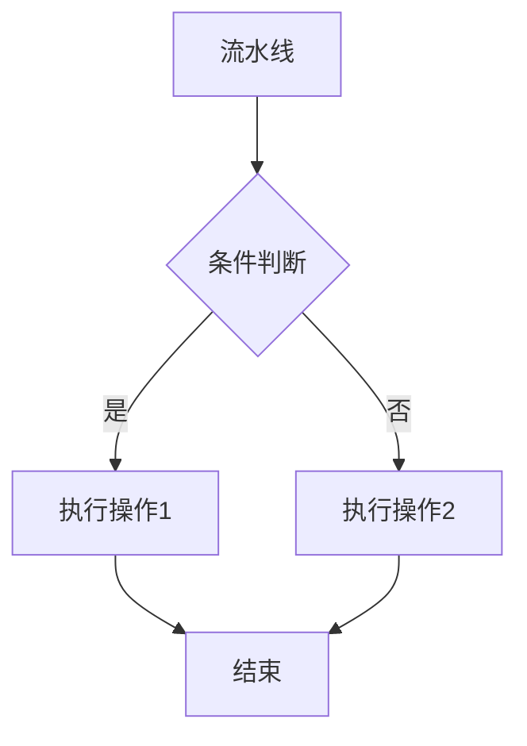

# 介绍
### RecGo推荐系统：一个智能化的"推荐工厂"

本章节主要是对推荐系统的整个流程进行了简单的介绍，如果之前对这个方面已经很熟悉了，就可以跳过该章节。


想象一家自动化工厂(**推荐场景: Scene**)，专门生产用户喜欢的推荐内容。这个工厂的运作流程可以分解为几个关键模块：

#### 一、工厂的原料货架（物料池: Item Pool）

- **货架上的货物**：所有可以被推荐的物品（视频/商品等）都在这里，就像超市货架上摆满了商品。
- **筛选过滤器**：可以设置"布尔条件"（如：只推荐价格低于100元的商品），过滤后得到精准的候选货架。
- **特推加速包**：某些热门商品会被贴上"优先推荐"标签，就像超市把促销商品摆放在显眼位置。

#### 二、多条智能流水线（流水线: Pipeline）

工厂内有不同流水线，每条都是独立的生产车间：

- **按比例开工**：不同流水线可能处理不同用户群体（例如：80%流量走A线，20%走B线）

- **四道核心工序**：
  
  ```
             ┌─────────────┐  
             │ 召回生产线 │→ 初筛500件候选商品  
             └──────┬──────┘  
                    ↓ 
             ┌─────────────┐  
             │ 召回生产线 │→ 初筛500件候选商品  
             └──────┬──────┘  
                    ↓   
             ┌─────────────┐  
             │ 排序加工区 │→ 精细打分并排出TOP100  
             └──────┬──────┘  
                    ↓  
             ┌─────────────┐  
             │ 重排包装站 │→ 确保结果多样性  
             └─────────────┘  
  ```
  
  1. **安检门（频控: Frequency Control）**：根据用户近期行为拦截不合适推荐（如：用户3天内看过5次的视频，暂停推荐）
  
  2. **寻宝机器人（召回: Recall）**：
  - **标签寻宝（匹配召回: Match Recall）**：根据用户特征（如：性别/兴趣标签）在索引库搜索相关物品（如：用用户年龄+城市生成查询键，最多找200件货"）
  - **AI寻宝（模型召回: Model Recall）**：用AI模型预测用户喜好，类似"猜你喜欢"功能
  3. **智能评分机（排序: Rank）**：
  - **规则打分**：按预设公式计算得分（如：热度=播放量×0.6+点赞量×0.4）
  - **AI评分**：用更复杂的AI模型进行精细排序
  - **通道优先级**：设置不同召回渠道的优先顺序（如：先显示AI推荐结果）
  4. **质检关卡（重排: Rerank）**：
  - 防止推荐结果单一化（如：同类型商品最多出现3次）
  - 可设置多个质检规则（如：品牌重复次数、价格区间分布）

#### 三、成品输出（API接口）

最终生成的推荐列表会通过标准接口（就像工厂的出货通道）提供给APP/网站使用。每个推荐场景（视频流/电商站等）都有专属的出货渠道。



