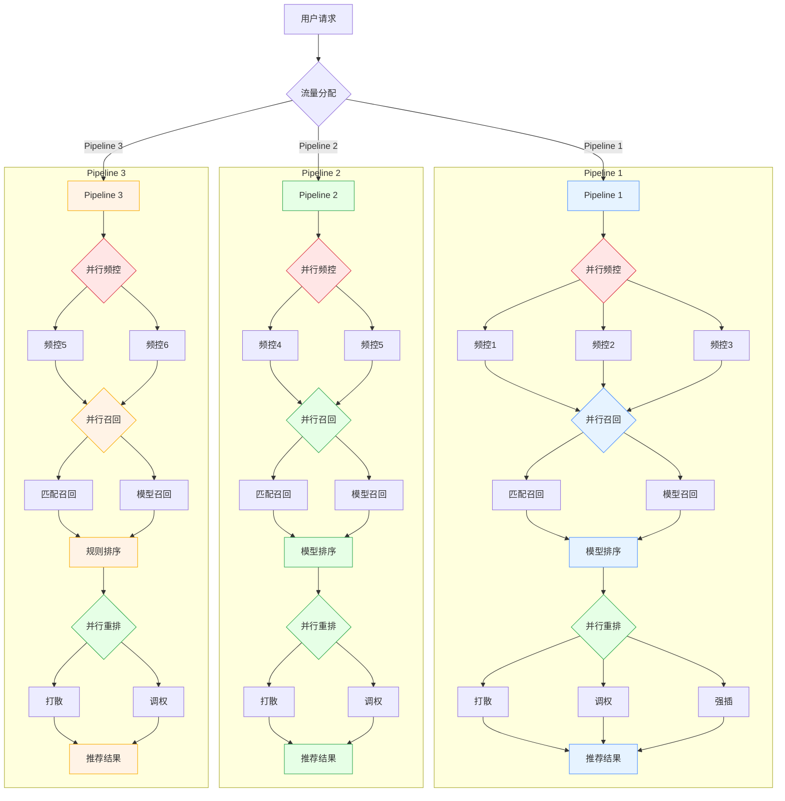

# RecGo推荐系统架构简介

本系统采用模块化工业流水线设计，将推荐流程解耦为六大核心组件，形成完整的推荐生产链路：

**1. 物料池（Item Pool）**  
作为系统的"原料仓库"，负责商品存储、质量过滤。通过库存状态、时效性等业务规则筛选可推荐商品，构建高质量候选商品库。

**2. 流水线（Pipeline）**  
扮演"生产调度中心"角色，通过可编排的流程模板协调各组件工作。支持多策略AB实验，根据用户类型动态分配流量至不同策略组合（如保守推荐、新品探索、促销导购），实现策略的灵活部署与灰度发布。

**3. 频控系统（Frequency Control）**  
承担"用户体验守护者"职责，基于时间滑动窗口分析用户历史行为，对重复出现的商品/类目进行智能拦截。采用分级管控策略，对高价商品实施严格频控，对快消品适当放宽限制。

**4. 召回系统（Recall）**  
作为"候选集生产车间"，包含匹配召回与模型召回双引擎。匹配召回通过用户显性特征实现精准检索，模型召回利用嵌入向量捕捉深层兴趣，两者协同保障召回结果的覆盖率与相关性。

**5. 排序系统（Rank）**  
担任"商品质量检测官"，采用规则+模型双阶段排序。规则层快速执行运营策略（如促销加权），模型层通过CTR预估进行精细化打分，兼顾业务目标与用户体验的平衡。

**6. 重排系统（Rerank）**  
作为"最终装配线"，通过多样性约束、疲劳度衰减等策略优化列表展示效果。保障推荐结果在品牌、价格带、类目等维度的合理分布，避免同质化推荐带来的用户体验下降。

整个系统通过API网关对外提供服务，接收用户特征与上下文参数后，依次执行频控过滤→多路召回→混合排序→多样性调整的标准化生产流程，最终输出30-50个有序商品ID列表，响应延迟控制在200ms以内。

