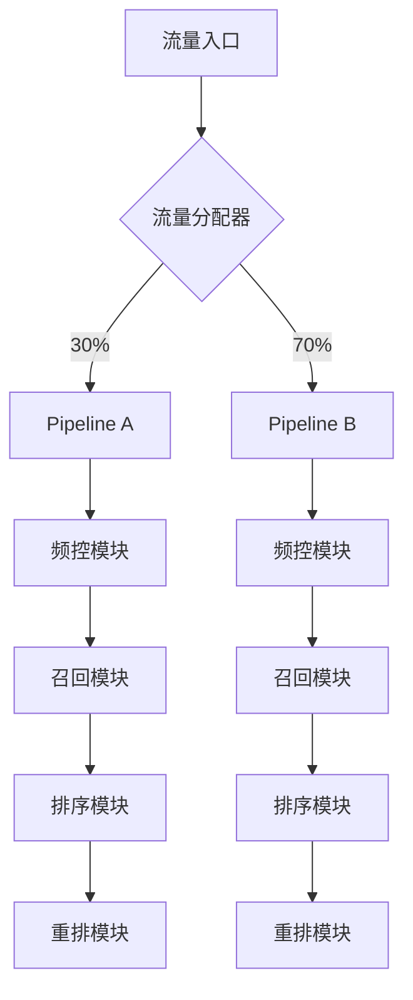

# 流水线

## 体系架构

我们将推荐流水线定义为承载完整推荐逻辑的工作流（Workflow），其技术架构具有以下特征：



## 核心特性

1. **流量分治**：支持创建多条独立工作流进行策略对比（A/B测试）
2. **模块热插拔**：各处理环节（召回/排序等）支持动态配置和启停
3. **灰度发布**：通过流量比例控制新策略的渐进式发布

## 配置规范

### 基础配置项

| 参数名称   | 数据类型   | 约束条件        | 功能说明         |
| ------ | ------ | ----------- | ------------ |
| name   | string | 全局唯一        | 流水线唯一标识      |
| flow   | int    | 1≤value≤100 | 流量分配比例（百分比制） |
| status | bool   | true/false  | 生产环境生效开关     |

### 配置模块清单

```toml
[[Pipeline]]  # 多实例配置标识
name = "experiment-pipeline-v3"  # 推荐使用语义化版本命名
flow = 30       # 当前流水线承载30%流量
status = true   # 生产生效状态

[[Pipeline.Freq]]    # 频率控制集群配置
...

[[Pipeline.Recall]]  # 召回策略集合配置
...

[Pipeline.Rank]      # 排序模型配置
...

[[Pipeline.Rerank]]  # 重排规则链配置
... 
```

## 电商应用示例

某大促场景配置双流水线：

- **主流线(70%流量)**
  - 召回：商品协同过滤+实时热榜
  - 排序：DNN混合模型v4
- **实验线(30%流量)**
  - 召回：向量召回+搜索增强
  - 排序：XGBoost轻量级模型
