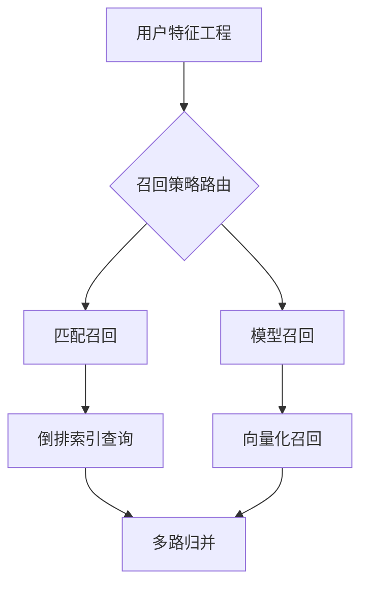

# 召回

## 定位

召回层作为推荐系统的第一级漏斗，核心使命是数以万计的物料池中高效筛选出千级候选集，需同时满足：

- 高覆盖率：捕捉用户90%+潜在兴趣点
- 低延迟：平均响应时间\<20ms
- 多样性：确保候选集覆盖20+兴趣维度

## 核心架构



### 1. 匹配召回 (Match Recall)

**技术原理**：基于规则引擎的特征组合检索

**典型应用场景**：

- 冷启动用户偏好捕捉
- 强特征引导场景（比如：地理位置/紧急需求）
- 实时热点内容捕捉

**配置矩阵**：

根据25岁男性用户生成键user_25_male，从倒排索引中召回商品。

```toml
[[Pipeline.Recall]]
name = "demographic_match"  # 策略唯一标识
recall_type = 0             # 召回类型
template = "user_%d_%s"      # 特征组合范式
fields = "age,gender"        # 使用的用户特征
keys = 20                     # 特征组合维度
count = 100                 # 单次召回上限 
```

### 2. 模型召回 (Model Recall)

通常的方案是双塔召回，即用户特征经过DNN产生一组多维向量，物料特征经过事先处理好也产生一组多维向量，然后用向量查找的方式在物料池中找到距离最近的N个向量。

```python
# 双塔模型结构示意
user_tower = DNN(user_features)
item_tower = DNN(item_features)
similarity = cosine(user_tower, item_tower)
```

**配置矩阵**：

```toml
[[Pipeline.Recall]]
name = "dnn_vector"       # 策略标识
recall_type = 1    # 服务类型
endpoint = "http://recall-svc.prod:8501"  # 服务端点
count = 100     # 单次召回上限
```

## 系统特性

1. **多策略并行**：支持多路召回通道并行执行
2. **动态权重分配**：基于实时反馈自动调整各通道召回比例
3. **降级机制**：在95%分位延迟超100ms时自动切换备选策略
